<p align="center">
  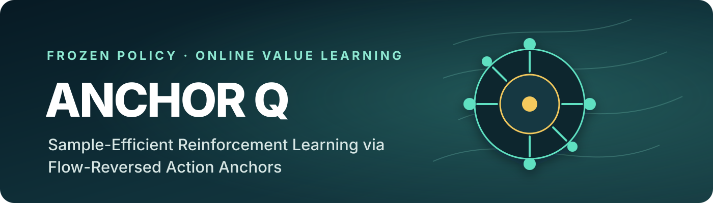
</p>

<p align="center">
  <strong>Anonymous authors · Under double-blind review</strong>
</p>

<p align="center">
  <a href="#how-anchor-q-works">Method</a> ·
  <a href="#results">Results</a> ·
  <a href="#real-robot-videos">Robot videos</a> ·
  <a href="#theory-in-one-minute">Theory</a> ·
  <a href="#implementation-details">Implementation</a>
</p>

> A frozen flow policy already knows many useful motions. Anchor Q turns a small library of those motions into state-conditioned latent actions, then learns which one to use and how to refine it.

## What is Anchor Q?

Generalist vision-language-action policies provide a strong behavioral prior, but their zero-shot performance can be too unreliable for deployment. Reinforcement learning can improve them without updating the large policy itself by treating the policy's initial flow noise as the action. The difficulty is that this latent noise space is high-dimensional, continuous, and has no stable behavioral meaning.

**Anchor Q replaces unrestricted latent exploration with a structured, coarse-to-fine search.** At every decision:

1. A small set of reference motions is mapped backward through the frozen flow model.
2. This produces state-conditioned latent **anchors** with fixed semantic roles.
3. A learned critic selects a promising anchor.
4. Local particles add fine control around that anchor.
5. Value-weighted averaging produces the latent executed by the frozen policy.

The policy weights remain frozen, and no latent actor is trained.

## How Anchor Q works

<p align="center">
  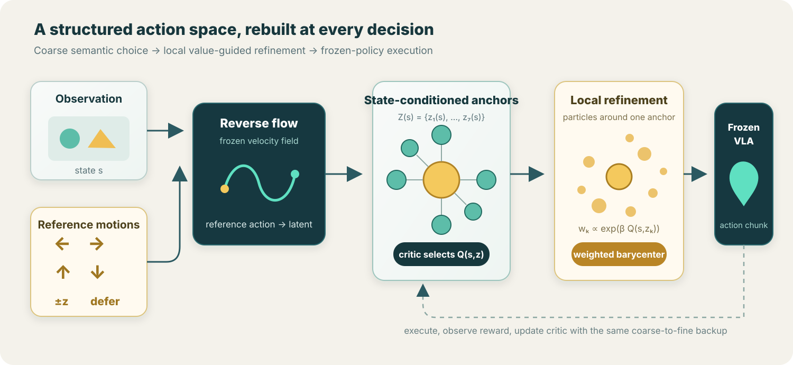
</p>

The anchor library contains six Cartesian motion directions and one **defer** action sampled from the base noise prior. Flow reversal rebuilds their latent realization for the current observation. The critic therefore scores actual latents, `Q(s, z)`, while the reference labels retain stable behavioral meaning.

After selecting an anchor `z_c(s)`, Anchor Q samples local particles:

`z_{c,k}(s) = z_c(s) + sigma_P * epsilon_k`

It then assigns softmax weights using the critic and executes their weighted barycenter:

`w_k ∝ exp(beta * Q(s, z_{c,k}))` and `z_tilde = sum_k w_k * z_{c,k}`

The weighted latent `z_tilde` is decoded by the frozen flow policy into an action chunk. The same coarse-to-fine construction is used in the Bellman target.

## Results

### Real robot

Each result below uses 20 evaluation configurations on a Franka arm with a Robotiq gripper and a DROID-style setup.

<p align="center">
  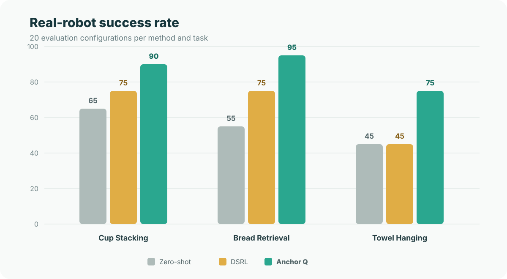
</p>

| Method | Blue-on-Yellow Cup Stacking | Bread Retrieval and Plating | Dishwasher-Rack Towel Hanging | Mean |
|:--|--:|--:|--:|--:|
| Zero-shot frozen policy | 65% | 55% | 45% | 55.0% |
| DSRL | 75% | 75% | 45% | 65.0% |
| **Anchor Q** | **90%** | **95%** | **75%** | **86.7%** |

Anchor Q improves the mean success rate by **21.7 percentage points** over DSRL. The largest absolute gain is on Dishwasher-Rack Towel Hanging, where explicitly choosing a coarse motion direction is especially useful.

### Simulation

All methods steer the same frozen flow-matching VLA. Reported values are the mean over four seeds, with one standard error.

<p align="center">
  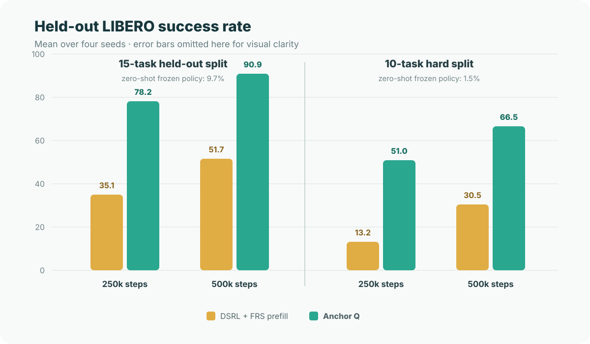
</p>

| Benchmark | Steps | DSRL + FRS prefill | Anchor Q |
|:--|--:|--:|--:|
| LIBERO 15-task held-out split | 250k | 35.1 ± 2.0 | **78.2 ± 1.8** |
| LIBERO 15-task held-out split | 500k | 51.7 ± 2.2 | **90.9 ± 1.2** |
| LIBERO 10-task hard split | 250k | 13.2 ± 4.3 | **51.0 ± 1.9** |
| LIBERO 10-task hard split | 500k | 30.5 ± 2.8 | **66.5 ± 3.5** |

At 250k interactions on the 15-task split, Anchor Q already exceeds the continuous latent learner's result at 500k interactions.

### What carries the gain?

On the LIBERO 15-task split at 500k steps:

| Variant | Success rate |
|:--|--:|
| DSRL + FRS prefill | 51.7 ± 2.2 |
| Anchor Q, anchors only | 86.5 ± 1.8 |
| **Anchor Q, anchors + local particles** | **90.9 ± 1.2** |

Most of the improvement comes from keeping flow-reversed anchors inside online action selection. Particle tilting adds a smaller but consistent gain by refining the selected motion locally.

## Real-robot videos

The three benchmark tasks use concise, action-oriented names below. Individual rollouts are silent, web-optimized copies; long stationary openings were shortened to roughly two seconds while the task execution remains intact. Each animated preview shows the complete rollout at an adjusted speed, plays once, and stops on the final frame. Select it to play the full-speed video.

### Bread Retrieval and Plating · 95% success

**Instruction:** Pick up the bread from the toaster and place it on the plate.

#### Anchor Q rollouts

<table>
  <tr>
    <td align="center"><strong>Rollout 1</strong><br><a href="assets/videos/real_world/bread_anchor_q_1.mp4"></a></td>
    <td align="center"><strong>Rollout 2</strong><br><a href="assets/videos/real_world/bread_anchor_q_2.mp4">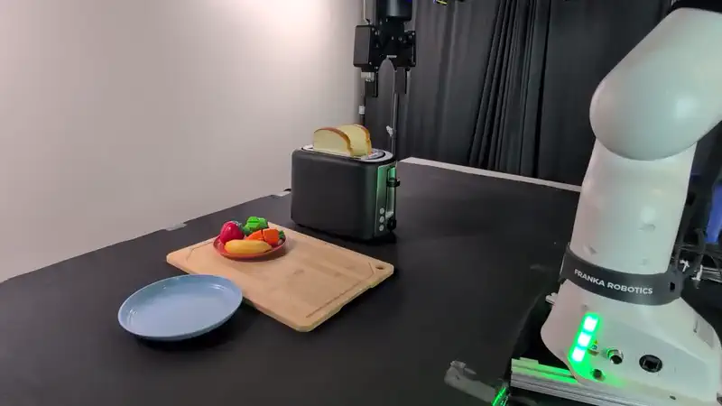</a></td>
    <td align="center"><strong>Rollout 3</strong><br><a href="assets/videos/real_world/bread_anchor_q_3.mp4">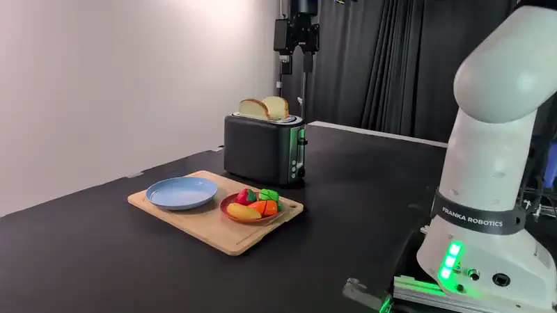</a></td>
  </tr>
</table>

#### Frozen-policy rollouts

<table>
  <tr>
    <td align="center"><strong>Rollout 1</strong><br><a href="assets/videos/real_world/bread_frozen_policy_1.mp4">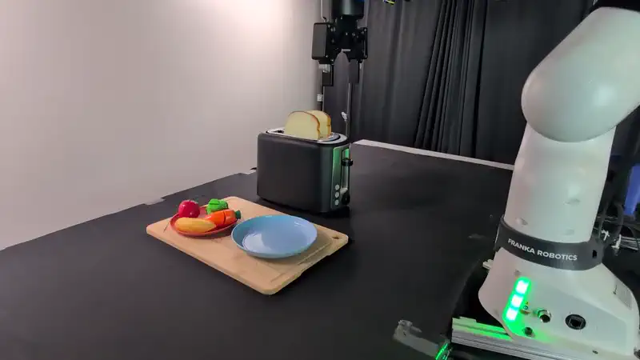</a></td>
    <td align="center"><strong>Rollout 2</strong><br><a href="assets/videos/real_world/bread_frozen_policy_2.mp4">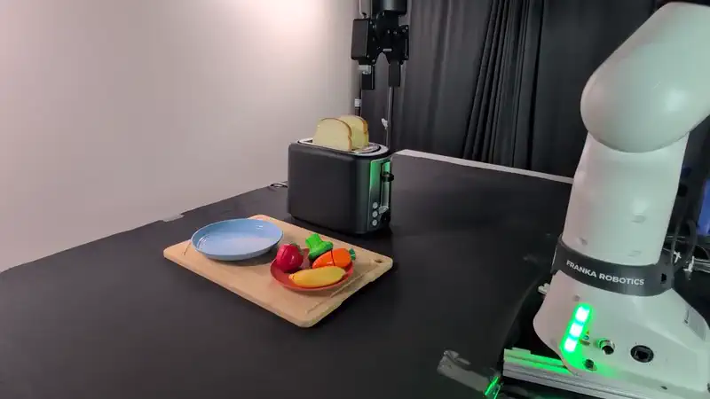</a></td>
  </tr>
</table>

### Dishwasher-Rack Towel Hanging · 75% success

**Instruction:** Pick up the towel and hang it on the dishwasher rack.

#### Anchor Q rollouts

<table>
  <tr>
    <td align="center"><strong>Rollout 1</strong><br><a href="assets/videos/real_world/towel_anchor_q_1.mp4">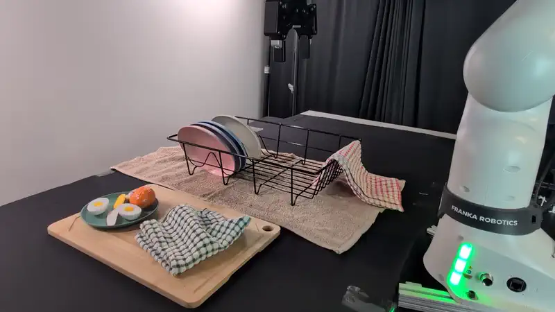</a></td>
    <td align="center"><strong>Rollout 2</strong><br><a href="assets/videos/real_world/towel_anchor_q_2.mp4">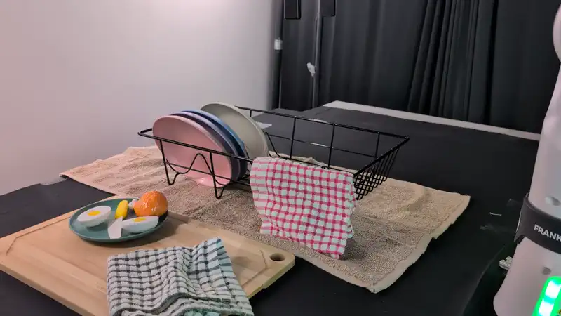</a></td>
    <td align="center"><strong>Rollout 3</strong><br><a href="assets/videos/real_world/towel_anchor_q_3.mp4">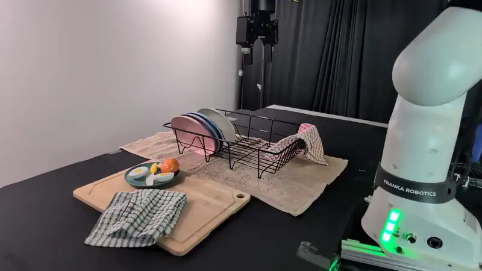</a></td>
  </tr>
</table>

#### Frozen-policy rollouts

<table>
  <tr>
    <td align="center"><strong>Rollout 1</strong><br><a href="assets/videos/real_world/towel_frozen_policy_1.mp4">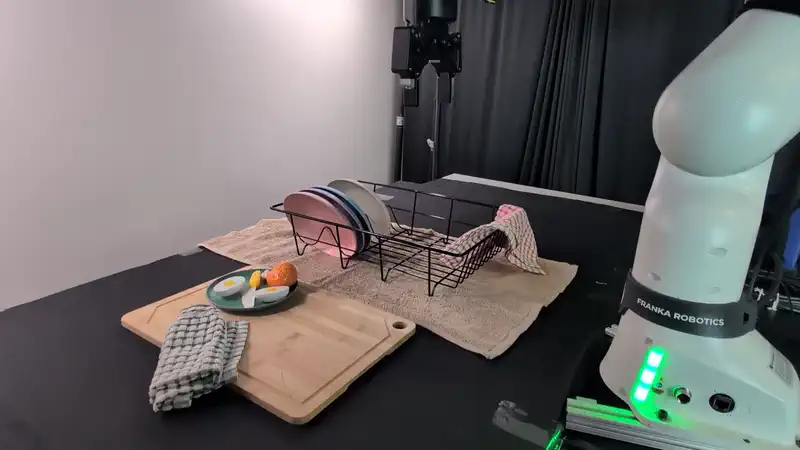</a></td>
    <td align="center"><strong>Rollout 2</strong><br><a href="assets/videos/real_world/towel_frozen_policy_2.mp4">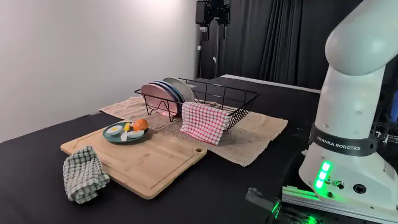</a></td>
  </tr>
</table>

### Blue-on-Yellow Cup Stacking · 90% success

**Instruction:** Pick up the blue cup and stack it on the yellow cup.

#### Anchor Q rollouts

<table>
  <tr>
    <td align="center"><strong>Rollout 1</strong><br><a href="assets/videos/real_world/cup_stack_anchor_q_1.mp4">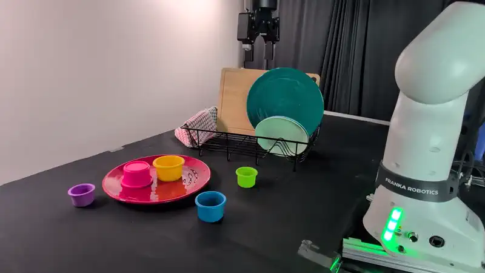</a></td>
    <td align="center"><strong>Rollout 2</strong><br><a href="assets/videos/real_world/cup_stack_anchor_q_2.mp4">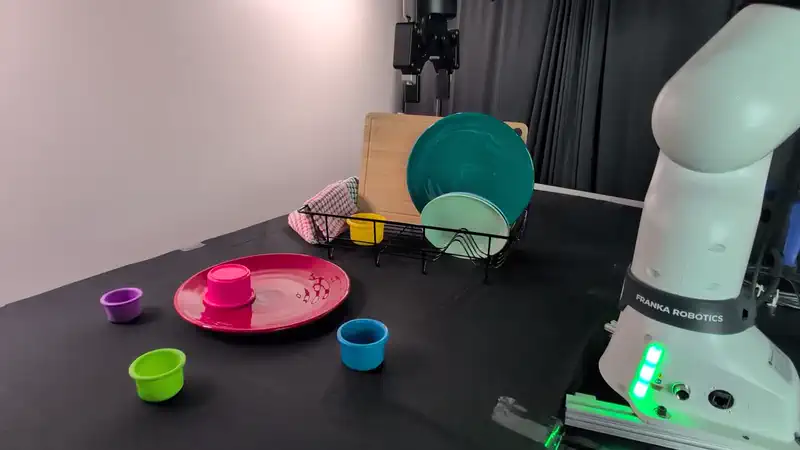</a></td>
    <td align="center"><strong>Rollout 3</strong><br><a href="assets/videos/real_world/cup_stack_anchor_q_3.mp4">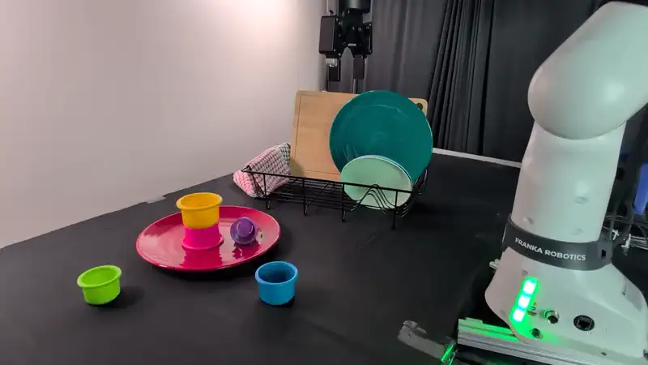</a></td>
  </tr>
</table>

#### Frozen-policy rollouts

<table>
  <tr>
    <td align="center"><strong>Rollout 1</strong><br><a href="assets/videos/real_world/cup_stack_frozen_policy_1.mp4">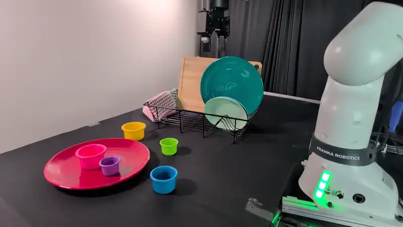</a></td>
    <td align="center"><strong>Rollout 2</strong><br><a href="assets/videos/real_world/cup_stack_frozen_policy_2.mp4">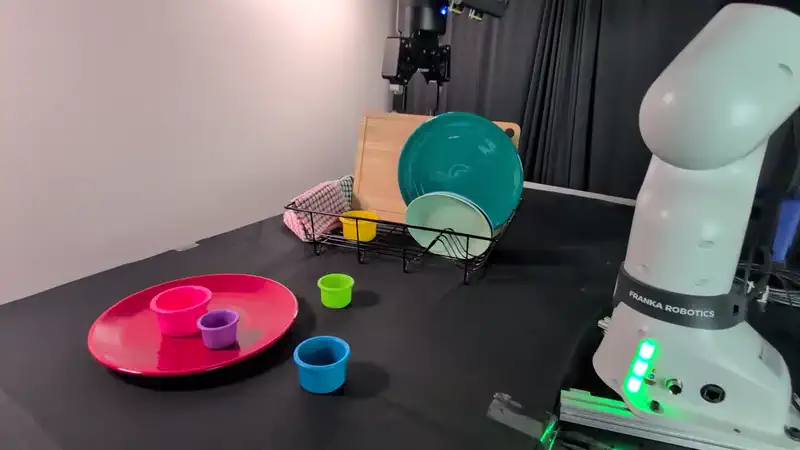</a></td>
  </tr>
</table>

#### Additional Anchor Q rollout — challenging configuration

<p align="center">
  <a href="assets/videos/real_world/cup_stack_challenging.mp4">
    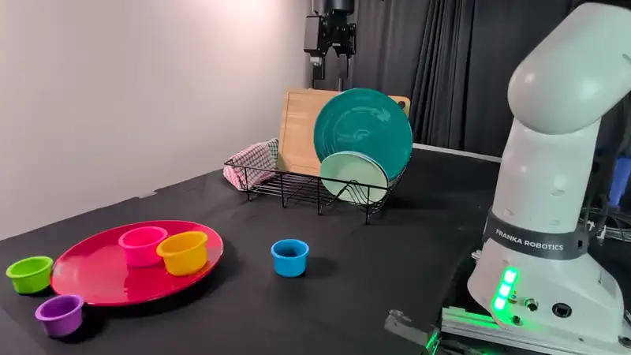
  </a>
</p>

### Evaluation montages

The animated images are short previews of aggregate Anchor Q evaluations. Select a preview for the full montage, or use the method-comparison links below it.

#### Blue-on-Yellow Cup Stacking

<p align="center">
  <a href="assets/videos/stack_cups_anchor_q.mp4">
    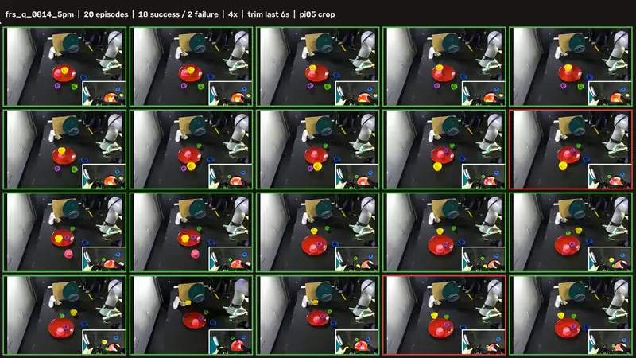
  </a>
</p>

<p align="center">
  <a href="assets/videos/stack_cups_zero_shot.mp4">Zero-shot · 65%</a> &nbsp;·&nbsp;
  <a href="assets/videos/stack_cups_dsrl.mp4">DSRL · 75%</a> &nbsp;·&nbsp;
  <a href="assets/videos/stack_cups_anchor_q.mp4"><strong>Anchor Q · 90%</strong></a>
</p>

#### Bread Retrieval and Plating

<p align="center">
  <a href="assets/videos/toast_bread_anchor_q.mp4">
    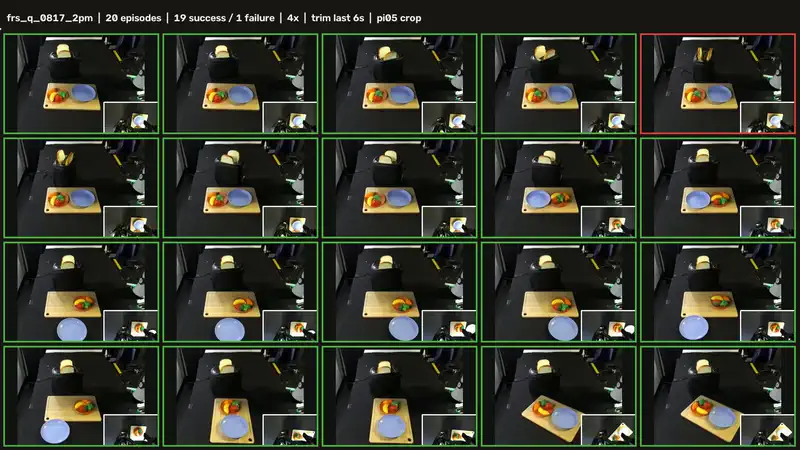
  </a>
</p>

<p align="center">
  <a href="assets/videos/toast_bread_zero_shot.mp4">Zero-shot · 55%</a> &nbsp;·&nbsp;
  <a href="assets/videos/toast_bread_dsrl.mp4">DSRL · 75%</a> &nbsp;·&nbsp;
  <a href="assets/videos/toast_bread_anchor_q.mp4"><strong>Anchor Q · 95%</strong></a>
</p>

#### Dishwasher-Rack Towel Hanging

<p align="center">
  <a href="assets/videos/hang_towel_anchor_q.mp4">
    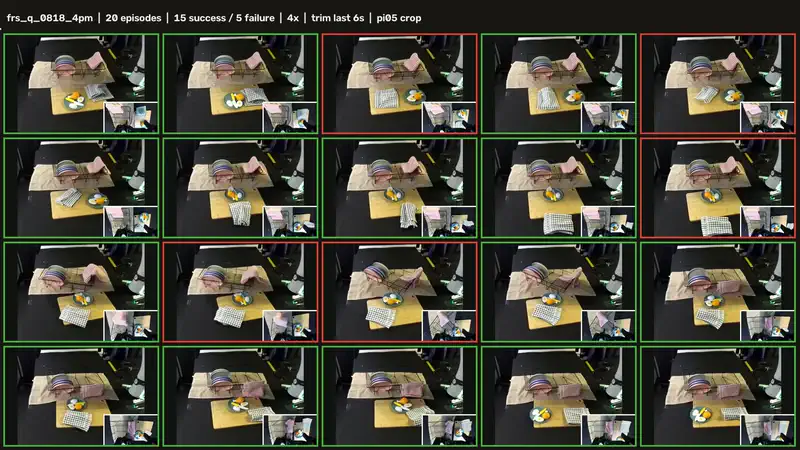
  </a>
</p>

<p align="center">
  <a href="assets/videos/hang_towel_zero_shot.mp4">Zero-shot · 45%</a> &nbsp;·&nbsp;
  <a href="assets/videos/hang_towel_dsrl.mp4">DSRL · 45%</a> &nbsp;·&nbsp;
  <a href="assets/videos/hang_towel_anchor_q.mp4"><strong>Anchor Q · 75%</strong></a>
</p>

## Theory in one minute

Anchor Q makes an explicit tradeoff between learning difficulty and representation bias:

- **Fewer alternatives are easier to identify.** If a near-optimal behavior is present in a set of `C` anchors, identifying it can require substantially fewer online samples than searching a larger class of `N` latent actions.
- **Restriction creates support bias.** An exact anchor set may omit a behavior needed for the task.
- **Particles trace a bias–complexity frontier.** Expanding a neighborhood around each anchor can recover missing behaviors, while increasing the number of alternatives the learner must distinguish.
- **Value tilting is directed local search.** Exponential weighting is the optimizer of a KL-regularized entropic objective. It favors truly better refinements when their value margin is larger than the critic's estimation error.

This explains the empirical pattern: semantic anchors supply most of the sample-efficiency gain, while particles recover fine control without returning to unrestricted latent exploration.

## Implementation details

| Component | Default |
|:--|:--|
| Frozen flow-policy steps | 10 Euler steps |
| Replanning horizon | 10 robot substeps |
| Anchor bank | 7 anchors: six spatial directions + defer |
| Latent shape | 10 × 32 |
| Critic ensemble | 10 critics |
| Local particles | 8 per selected anchor, including the center |
| Particle scale | `sigma_P = 0.5` |
| Particle temperature | 1.0 |
| Particle warmup | 10,000 decisions |
| Exploration | `epsilon: 1.0 → 0.05` over 10,000 decisions |

The aggregate numbers used on this page are available in [`data/results.json`](data/results.json). Video processing and source-to-web filename mappings are recorded in [`data/real_world_video_manifest.json`](data/real_world_video_manifest.json).

## Citation

```bibtex
@inproceedings{anonymous2027anchorq,
  title     = {Sample-Efficient Reinforcement Learning via Flow-Reversed Action Anchors},
  author    = {Anonymous},
  booktitle = {Under review},
  year      = {2027}
}
```
